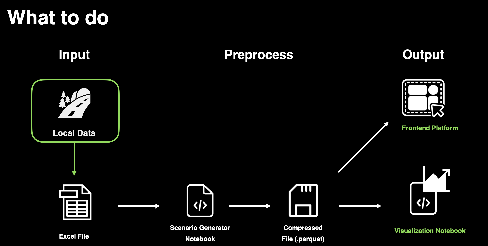

# Transport Decarbonization Pathways Toolkit

Toolkit to generate and visualize passenger-transport decarbonization pathways for different City Science Labs or regions. The goal is to make the same scenario engine reusable across labs by changing one structured Excel input file.



## What It Does

This repository builds a master scenario dataset for passenger mobility pathways from 2025 to 2050. Each scenario combines five levers:

- EV adoption target
- modal shift from private car to active/public transport
- motorized demand reduction
- embodied-emissions reduction
- electricity-grid decarbonization pathway

The output is a Parquet dataset with cumulative and annual per-capita emissions for every pathway, plus visualization notebooks for Pareto clouds, annual trajectories, and feasible pathways under IPCC-derived budget ceilings.

## Why It Matters

Transport decarbonization pathways are often hard to compare across cities because inputs, assumptions, and model structures change. This toolkit separates local data from the scenario engine, so another lab can reuse the same model by filling the Excel template with its own population, fleet, modal split, VKT, occupancy, and emissions-share assumptions.

## Main Files

- `Toolkit_Mobility_Pathways_Inputs.xlsx`: input template for each lab.
- `Scenarios_Definition_Levers_ASI_from_Toolkit_Inputs.ipynb`: generates the scenario Parquet from the Excel input.
- `Results_Cloud_Analysis_Transferable.ipynb`: visualizes any lab result.
- `Scenarios_Definition_Levers_ASI_Boston.ipynb`: Boston-ready example.
- `Results_Cloud_Analysis_Boston.ipynb`: Boston-ready visualization example.
- `Squema.png`: workflow schema.

## How To Use

1. Fill `Toolkit_Mobility_Pathways_Inputs.xlsx` for your lab:
   - `CONFIG`
   - `macro`
   - `modal_split`
   - `fleet`
   - `VKT and occupancy (if found)`

2. Open `Scenarios_Definition_Levers_ASI_from_Toolkit_Inputs.ipynb` and set:

```python
LAB_ID = "BOS"  # or your lab ID
OUTPUT_STEM = "scenarios_master_boston"
APPLY_GIP_COMPATIBILITY_PATCH = False
```

3. Run all cells. This creates:

```text
scenarios_master_boston.parquet
scenarios_master_boston_preview.csv
```

4. Open `Results_Cloud_Analysis_Transferable.ipynb` and set:

```python
LAB_ID = "BOS"
PARQUET_PATH = Path("scenarios_master_boston.parquet")
```

5. Set the emissions-share inputs used for budget ceilings:

```python
TRANSPORT_EMISSIONS_SHARE_OVERRIDE = 0.25
PASSENGER_TRANSPORT_WITHIN_TRANSPORT_SHARE_OVERRIDE = 0.32
```

or directly:

```python
PASSENGER_TRANSPORT_EMISSIONS_SHARE_OVERRIDE = 0.08
```

6. Run all cells. Results are saved in:

```text
results_viewer_outputs/<lab_id>/
```

## Budget Ceiling Method

The visualization notebook computes per-capita passenger-transport budget ceilings as:

```text
((IPCC budget GtCO2 - 5 * 35 GtCO2) * passenger transport emissions share * 1e9) / 8.2e9
```

Current budget points:

- 1.5 C: 500 GtCO2
- 1.7 C: 850 GtCO2
- 2.0 C: 1350 GtCO2

## GitHub Note

Parquet outputs can be large. For GitHub, consider tracking notebooks, the Excel template, `Squema.png`, and small CSV previews, while storing large `.parquet` files with Git LFS or regenerating them locally.
